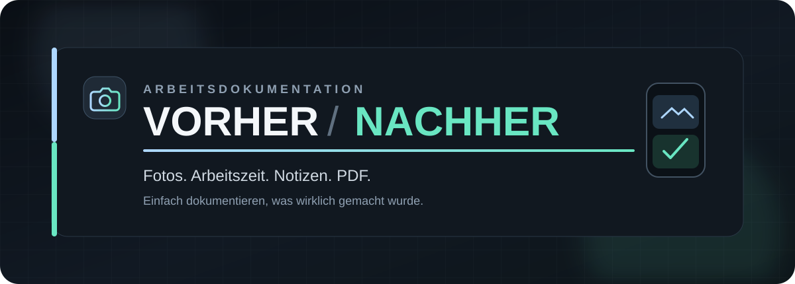
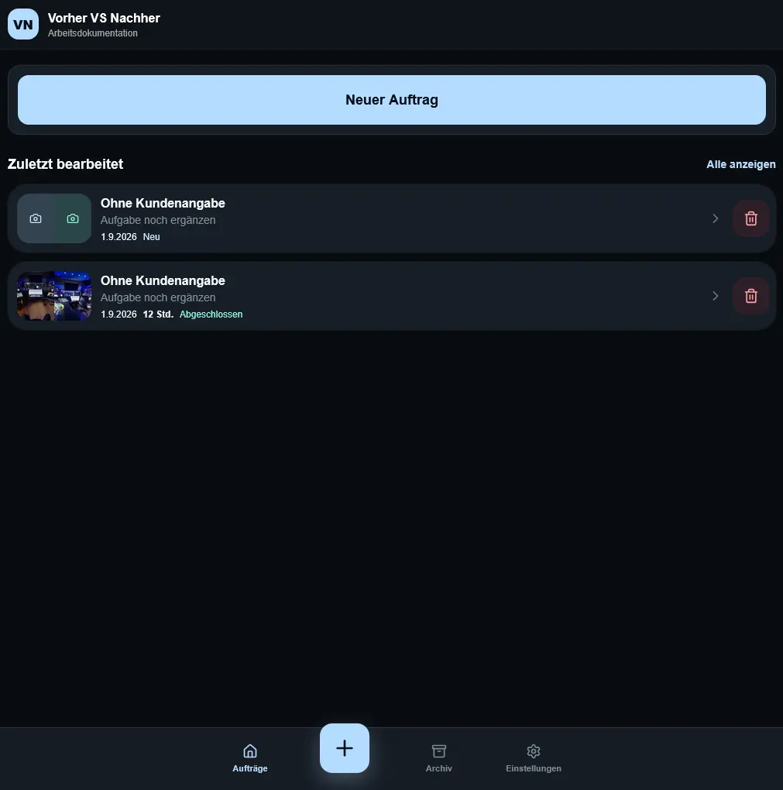
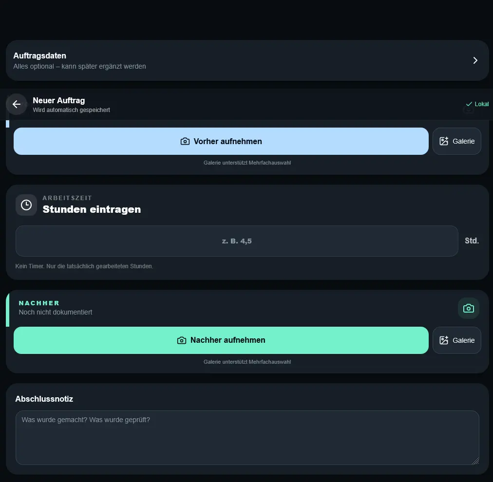
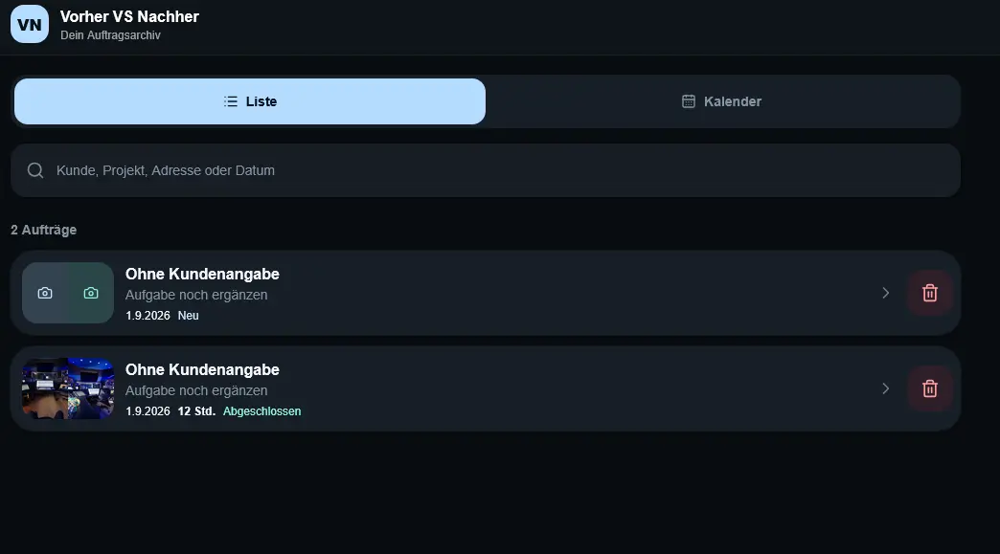
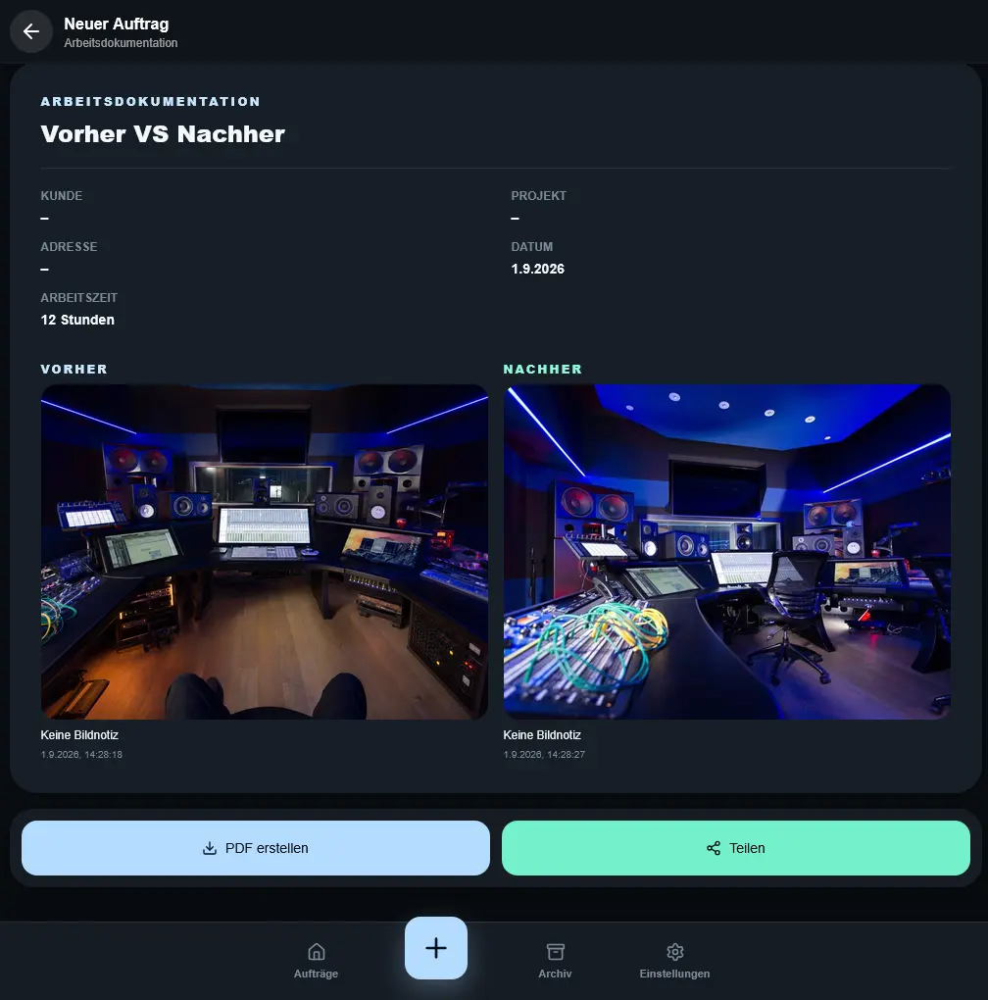

<div align="center">



<br>

[](https://github.com/paddo1210/vorher-nachher/releases/latest)
[](https://github.com/paddo1210/vorher-nachher/releases/download/v1.0.1/Vorher-Nachher-v1.0.1.apk)
[](https://vorher-vs-nachher.dreamy-sky-2007.chatgpt.site/)
[](#datenschutz--speicherung)

### Dokumentiere deine Arbeit. Einfach, schnell und nachvollziehbar.

Vorher-Fotos aufnehmen · Arbeitszeit eintragen · Nachher-Fotos sichern · PDF erstellen

**[Web-App öffnen](https://vorher-vs-nachher.dreamy-sky-2007.chatgpt.site/)** &nbsp;·&nbsp;
**[Android APK herunterladen](https://github.com/paddo1210/vorher-nachher/releases/download/v1.0.1/Vorher-Nachher-v1.0.1.apk)** &nbsp;·&nbsp;
**[Alle Releases](https://github.com/paddo1210/vorher-nachher/releases)**

</div>

---

## Wie ist die App entstanden?

Die Idee kommt direkt aus dem echten Arbeitsalltag: Wenn ich bei einem Kunden handwerklich arbeite, mache ich vorher Fotos vom ursprünglichen Zustand – und nach getaner Arbeit noch einmal Fotos vom Ergebnis. So lässt sich später nicht nur erzählen, was gemacht wurde. Man kann es direkt zeigen.

Was bisher über Kamera, Galerie, Notizen und Arbeitszeiten verteilt war, sollte an einem einzigen Ort zusammenkommen. Ohne komplizierte Projektverwaltung, ohne unnötige Funktionen und ohne lange Einarbeitung.

So entstand **Vorher Nachher**: eine bewusst einfache App für Handwerker, mit der ein Arbeitseinsatz vom ersten Foto bis zum fertigen Arbeitsnachweis sauber dokumentiert werden kann.

> **Aus einer einfachen Gewohnheit wurde ein digitales Werkzeug für den Arbeitsalltag.**

## Die App im Einsatz

<table>
  <tr>
    <td width="50%" align="center">
      
      <br><strong>Startseite</strong><br><sub>Neue Dokumentation mit einem Fingertipp beginnen</sub>
    </td>
    <td width="50%" align="center">
      
      <br><strong>Auftrag dokumentieren</strong><br><sub>Fotos, Arbeitszeit und Abschlussnotiz an einem Ort</sub>
    </td>
  </tr>
</table>

<div align="center">
  
  <br><strong>Alles wiederfinden</strong><br>
  <sub>Auftragsarchiv mit Suche, Liste und Kalender</sub>
</div>

<br>

<div align="center">
  
  <br><strong>Das Ergebnis auf einen Blick</strong><br>
  <sub>Vorher/Nachher vergleichen, als PDF sichern oder direkt teilen</sub>
</div>

## Ein Auftrag. Ein klarer Ablauf.

| 01 · Vorher | 02 · Arbeit | 03 · Nachher | 04 · Nachweis |
|:--:|:--:|:--:|:--:|
| Ausgangszustand fotografieren | Tatsächliche Stunden eintragen | Ergebnis und Abschlussnotiz sichern | Dokumentation als PDF erstellen |

## Funktionen

- **Vorher- und Nachher-Fotos** direkt mit der Kamera aufnehmen oder aus der Galerie auswählen
- **Arbeitszeit in Stunden** eintragen – bewusst ohne laufenden Timer
- **Kunden-, Projekt- und Adressdaten** optional ergänzen
- **Notizen zu Bildern und Abschlussarbeiten** festhalten
- **Lokales Auftragsarchiv** durchsuchen und verwalten
- **Kalenderansicht** mit Monats-, Tages- und Zeitraumsauswahl nutzen
- **Vorher/Nachher direkt vergleichen**
- **Arbeitsnachweis als PDF** kompakt oder mit Bildern erzeugen
- **Dokumentation nativ teilen**
- **Als PWA oder Android-App** auf dem Smartphone verwenden

## Direkt loslegen

### Im Browser

Die Web-App kann ohne Registrierung direkt geöffnet werden:

**[Vorher Nachher als Web-App starten →](https://vorher-vs-nachher.dreamy-sky-2007.chatgpt.site/)**

Auf unterstützten Smartphones lässt sie sich zusätzlich über den Browser zum Startbildschirm hinzufügen.

### Auf Android

1. **[Vorher-Nachher-v1.0.1.apk herunterladen](https://github.com/paddo1210/vorher-nachher/releases/download/v1.0.1/Vorher-Nachher-v1.0.1.apk)**
2. Die heruntergeladene Datei auf dem Android-Gerät öffnen.
3. Falls Android nachfragt, die Installation aus dieser Quelle erlauben.
4. App installieren und starten.

> Bei einer bereits installierten Testversion mit anderer Signatur muss diese vor der Installation möglicherweise einmal deinstalliert werden.

## Datenschutz & Speicherung

Aufträge, Kundendaten, Notizen, Arbeitsstunden und Fotos werden in der aktuellen Version **ausschließlich lokal auf dem verwendeten Gerät** gespeichert. Es findet kein automatischer Upload von Fotos oder Kundendaten statt.

Das bedeutet gleichzeitig: Ohne Cloud-Synchronisation bleiben die Daten an diesen Browser beziehungsweise dieses Gerät gebunden. Vor einem Browser-Reset oder Gerätewechsel sollten wichtige Arbeitsnachweise deshalb als PDF gesichert werden.

## Technik

| Bereich | Umsetzung |
|---|---|
| Oberfläche | React 19, TypeScript, Tailwind CSS |
| Web-App | Vite / Vinext, installierbare PWA |
| Lokale Daten | IndexedDB |
| Dokumente | jsPDF |
| Teilen | Web Share API |
| Android | Trusted Web Activity, signierte Release-APK |
| Mindestversion | Android 6.0 / API 23 |

## Entwicklung

Den vollständigen Quellcode gibt es im jeweiligen [GitHub Release](https://github.com/paddo1210/vorher-nachher/releases/latest) als ZIP-Datei.

```bash
npm install
npm run dev
```

Produktions-Build und Tests:

```bash
npm run build
npm test
```

## Aktueller Stand

Die App ist als praxistaugliche erste Version verfügbar. Geräteübergreifende Synchronisation und Cloud-Backup sind aktuell nicht enthalten. Die lokal verfügbare Speicherkapazität hängt vom verwendeten Browser und Gerät ab.

---

<div align="center">

**Vorher Nachher** · Gebaut für echte Arbeit – nicht für komplizierte Verwaltung.

[Web-App](https://vorher-vs-nachher.dreamy-sky-2007.chatgpt.site/) · [APK](https://github.com/paddo1210/vorher-nachher/releases/download/v1.0.1/Vorher-Nachher-v1.0.1.apk) · [Releases](https://github.com/paddo1210/vorher-nachher/releases)

</div>
